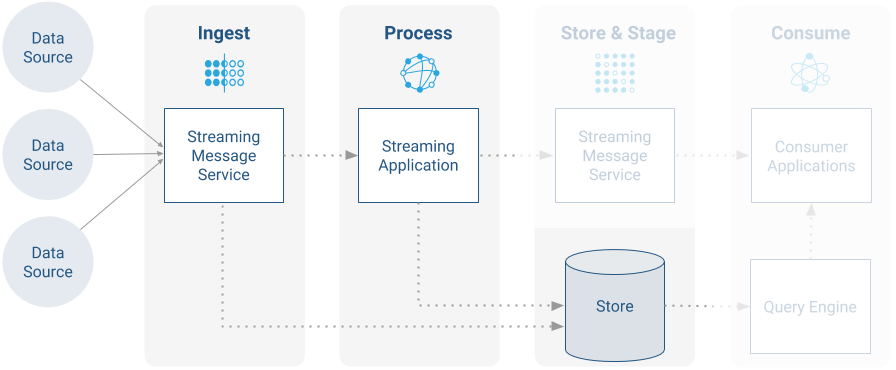
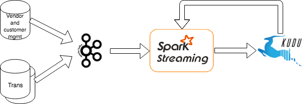
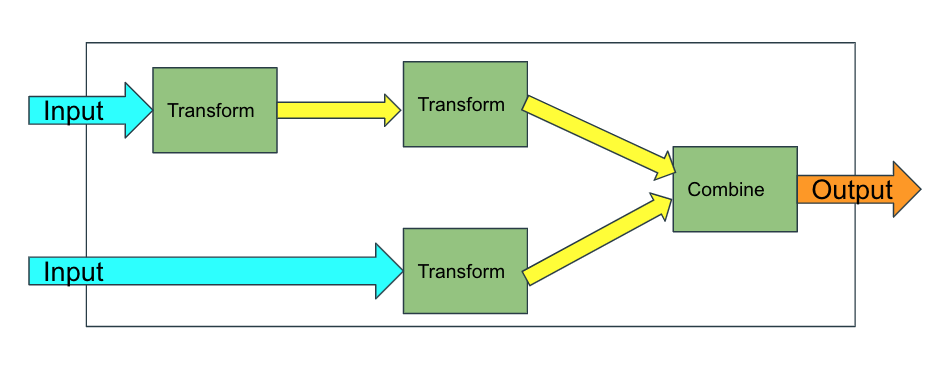
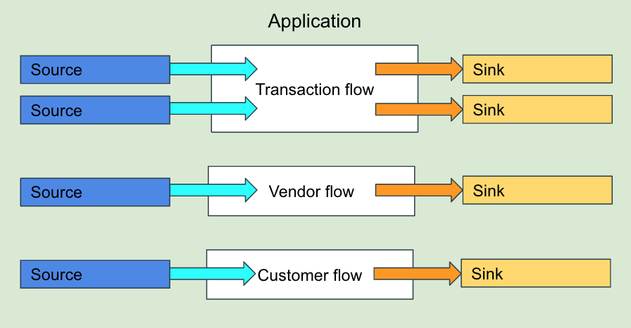

_Copyright &copy; Cloudera, Inc. 2019_
# Spark Structured Streaming reference application for the Cloudera stack

## Introduction

In recent years the speed of analytics increased almost as rapidly as the amount of data that needs to be processed.
As a consequence big data systems are also evolving to be more stream oriented, to be able to process data as it arrives.
These systems are usually built using several different components that need to be integrated.
Selecting these components and integrating them properly can be challenging.

This document attempts to give architects and software engineers enough context and
practical guidelines to start building such streaming systems using Spark Structured Streaming on the CDH platform.

The document starts with a quick overview of the main components of a typical streaming application and the components
in the CDH stack that can be used to realize such an application.

In the second part a reference application is described, showing how the streaming ingest use case can be implemented
using an Apache Kafka - Apache Spark Structured Streaming - Apache Kudu pipeline. The demonstrated integration techniques can be used
to cover the requirements of many other streaming use cases as well.

## Structure of streaming systems

The most important components of typical streaming systems can be understood using this diagram:

Arrows represent the direction of data flow between components.

*   Data source – data sources producing the raw **data stream** are the source of truth.
Typical sources include an existing (web) application, mobile and IOT devices, logs and many others.
*   Streaming message service – temporarily stores the data reliably until it's processed. **Ingest**ion often happens via a message service.
For many use cases high-throughput and/or low latency messaging system is needed.
*   Stream engines / application – these components **process** the incoming data stream by continuously executing (parts of) the application logic.
*   **Store** – the processed data is usually stored permanently for later use.
*   Query / analytic engine - stored data is often accessed using a query engine, most often using SQL.
*   **Consumer** applications – applications consuming the processed data/result streams.
They may present the data to the users and most often also includes some business logic.

This document focuses on the highlighted part of the system, describing a streaming ingest use case.

## CDH components for streaming applications

The data sources and the consumer applications are application specific.
The CDH stack provides components for the rest of the stream processing pipeline.

### Streaming message service

#### Kafka

Apache Kafka is a massively scalable, high performance publish-subscribe system.
It can be used to queue arriving messages prior to processing or move large amounts of data between components.

Kafka uses records with optional keys. Records are published to partitioned topics.
Partitions are replicated to ensure fault tolerance and durability. Message ordering is guaranteed within a partition.

Kafka uses a high performance, language agnostic TCP protocol for client-broker and inter-broker communication.
This protocol provides built-in load balancing and high availability, but only within one data center.
The protocol is designed to enable incremental evolution in a backward compatible fashion,
enabling brokers and clients to communicate even if their version differs.

#### Flume

Apache Flume is a distributed, reliable, and available battle-tested system designed to efficiently collect,
aggregate and move large amounts of log-like data from many different sources to a centralized data store.

The use of Apache Flume is not only restricted to log data aggregation. Since data sources are customizable,
Flume can be used to transport massive quantities of event data including but not limited to network traffic data,
social-media-generated data, email messages and pretty much any data source possible.
Many types of commonly used sources and sinks are supported out of the box.
Flume has the capability to modify and drop events in-flight.

Flume is often used in combination with Kafka (informally called "Flafka").
Flume can be on the producer, the consumer side of Kafka or both.
Using Flafka makes implementation of reliable streaming pipelines with simple or no logic,
it can often be done without coding. You can find more details about Flafka in
[Flafka: Apache Flume Meets Apache Kafka for Event Processing]( https://blog.cloudera.com/blog/2014/11/flafka-apache-flume-meets-apache-kafka-for-event-processing/),
and in the [Ingest Using Kafka with Apache Flume](https://www.cloudera.com/documentation/enterprise/latest/topics/kafka_end_to_end.html#kafka_and_flume)
section of the CDH 6.1 documentation.

### Stream processing system

#### Spark Structured Streaming

Structured Streaming provides a highly expressive, optimized, and concise way to express logic the same way as in the case of batch processing:
Structured Streaming treats a live data stream as a table that is being continuously appended and Spark runs it as an incremental query
on this unbounded input table, which is modelled as a DataSet/Dataframe. It's possible to use the SQL like API or SQL statements to define
queries. In CDH 6.1 Cloudera supports joins between streams and static tables.

Structured Streaming provides various semantic and fault tolerance guarantees to simplify development of real life streaming application
 (for example dealing with late data, ensuring exactly-once delivery, etc) and it has a high throughput with low latency.
 The currently supported minibatch processing model can typically achieve latency in the ~ 0.1 - 10 seconds range, depending on the use case.

Using Structured Streaming is a good basis for building machine learning pipelines, as MLlib (the Spark machine learning library)
also uses a DataFrame-based API as its primary API.
Existing MLlib models and pipelines can often be used to work with streaming data with little or no modification.

##### Note on dstreams

Using dstreams is the legacy streaming solution in Spark. It provides relatively low level of abstraction,
the stream is handled as a series of discretized batch operations.

Direct Streaming is no longer recommended by the Apache Spark community. Starting with 6.1 CDH supports Structured Streaming
and this is recommended instead of dstreams.

##### Note on continuous processing

Continuous processing mode can provide lower latency (in some cases a couple of milliseconds),
but as of the writing of this document it's not a mature technology.

CDH 6.1 includes the code that's needed to use continuous processing mode, but it's not supported,
so it should be only used for POC or testing, but not in production.

### Storage

#### HDFS

Apache HDFS is designed to reliably store very large files across machines in a large cluster. It can also store streaming output.
HDFS is immutable so is appropriate for storing a permanent record of every transaction in its raw form.  
Further HDFS can be used to offload the larger volumes of historical data from KUDU and HBase.  
This makes HDFS useful for compliance and auditing use-cases where each record as received needs to be stored in its original form.

Considerations for use include:

Partitioning:  Use an appropriate partitioning and compaction strategy to reduce the number of small files.
Sinks for Flume can be configured to define a schema, partitioning model and batch size for the output files.

Idempotency:  HDFS should be considered a raw log, it will include data as received, both out of order and containing duplicates.
HDFS should not be utilised as a storage schema for rationalising these issues and used rather as a low cost representation
of how the events were originally received. Data managed in KUDU and HBase can be standardised, resequenced and
de-duplicated due to the key and transactional support in these data stores.  
Once the data has been rationalised it can be 'backed-off' to HDFS for volume storage.

Analytical latency:  If using the Impala query engine over HDFS be aware that the catalog will need updating with new partitions.  
Commands like REFRESH should be used with care and it is not possible to establish a real-time view on the data.  
Please use Kudu as a storage backend for this scenario.

##### Auxiliary data store

Data stored on HDFS is durable, easily accessible from all nodes of a cluster. Other components often make use of it
to store auxiliary data, e.g. at the moment the only reliable way of storing checkpoints of Spark is HDFS.

#### HBase

Apache HBase gives random, realtime read/write access to very large tables. It provides a store that can be used against
event keys for re-ordering and de-duplicating events based on watermarks, ranges or unique ids.  
Datasets can have billion of records and millions of columns which is appropriate for storing event based data that needs in stream enrichment.  
HBase can be used for realtime data enrichment, standardisation, aggregation and error checking.

#### Kudu

Apache Kudu provides a combination of fast inserts/updates and efficient columnar scans to enable multiple real-time analytic workloads
across a single storage layer. A Kudu cluster stores tables that look just like tables you're used to from relational (SQL) databases.
Kudu tables can be used to store key-value pairs, or complex records with hundreds of strongly-typed attributes.

Kudu supports low-latency millisecond-scale access to individual rows and on the same storage do efficient data analytics,
dramatically simplifying application architecture if you need both possibilities.

Kudu is primarily designed for analytic use cases.

Kudu compared to HDFS in streaming pipelines:

* Spark streaming tends to create a high number of small files on HDFS, as it starts new files in each minibatch.
The number of files can be controlled by the minibatch size but it may introduce extra latency.
In addition these files often need extra mechanisms for compaction.
Kudu has built in compaction, micro batches can be sized according to the latency/throughput requirements,
the data is readily available in its final form, Impala can use it.

* Kudu currently has a number of usage limitations, for example scaling, security, backup and disaster recovery that may make it necessary to use
other storage (typically HDFS) in addition or instead of Kudu.
For more information, see [Apache Kudu Usage Limitations](https://www.cloudera.com/documentation/enterprise/latest/topics/kudu_limitations.html#scaling_limits)
and the [Kudu Scaling Guide](https://www.cloudera.com/documentation/enterprise/latest/topics/kudu_scaling.html).

### Data Flow Automation

#### NiFi
Apache NiFi was built to automate the flow of data between systems. It gives you out-of-the-box tools to ingest from a number of data sources in a
secure and governed manner. It supports guaranteed delivery, back pressure, prioritized queueing and flow specific QoS.
Flows can be created without any programming necessary, using a convenient GUI.
NiFi offers an integrated, easy to use solution for ingesting, moving and processing data and for many
use cases it can be a compelling alternative to building a more heavy-weight streaming system.  

## Use case: Streaming ingest of card transactions into Kudu

Streaming ingest is a frequent first use case of customers that start using Cloudera. The goal is to continuously move data
from the original data source where it was created to a long term storage that enables analysis in the future.
Data is often stored in raw form, but it may also be parsed, enriched with existing static data or
it might undergo (simple) transformation, aggregation or filtering.

For the purpose of the reference application we will use one concrete use case dealing with credit card transactions,
but the same architecture and integration techniques are applicable to a wide range of streaming use cases,
such as processing call detail records in telecommunications, clickstream data from web scale applications,
or for establishing a foundation for Industrial IOT.

### Use case description

#### General requirements

A bank wants to do analytics on credit and debit card transactions. Card transactions are made of a small number of steps.
The business group in the bank has some requirements that are essential for the application to be successful:

*   The data should show all the events that make up each transaction, such as a card swipe, or a bank authorization.
Users need to be able to view the transaction lifecycle, not just the final outcome.
*   A variety of source systems should be able to easily push transactions to our system with a high throughput.  
*   The transaction data should be very fresh — ideally showing transaction events up to only a few seconds after they occur.
Users may need to make quick decisions on sudden trends that are going on at that very moment.
*   The data history should be very deep — ideally with the ability to analyze across many billions of transactions that occurred
over years of customer activity. Users may need to compare current transactions to historical norms, or to do long-term trend analysis.
*   It should be possible to enrich, filter and aggregate data during ingestion.
*   We need to ensure quality of the ingested transaction records:
    *   It should be possible to validate the quality of the ingested transactions and filter out bad records,
    that is records that fail during validation check
    *   It should be possible to fix the faulty records and they should be processed by the pipeline
*   There should be a fast and flexible way to analyze the data.
*   The data must be tightly secured as it is highly sensitive.

For the purpose of the reference application we work with a simplified data model and store only the transactions,
the customers making the transaction and the vendor that the transaction is occurring at.

##### Notes on simplification
In real life there would be a high number of additional requirements or functionalities if one wanted to implement such a use case.
The goal of the reference application is to demonstrate how to build a streaming pipeline, not implementation of a production ready system.
As a consequence we work with a simplified model: a small, consistent set of requirements that are relevant from
the streaming point of view and gives a good starting point to implement a real life, production ready system.
Some of the extra requirements (e.g. slowly changing dimensions, bi-temporal modelling) may make the design and
implementation of streaming applications much more complicated . To fulfill these requirements consider using existing frameworks
such as [Envelope](https://github.com/cloudera-labs/envelope) that provide support for them, making implementation much simpler. Kudu is primarily designed for analytic use cases.
Depending on the use case and the amount of data you may want to use it in combination with other storage mechanisms,
e.g. store raw or archive data in HDFS.

## Pipeline

The application is realized using the following pipeline:

We assume that one external system manages customer and vendor data. For transactions we may have more source systems.
All of these data sources use Kafka clients to publish records to a cluster of Kafka Brokers.
The brokers store data temporarily until Spark Structured Streaming finishes processing and data is written to Kudu.
Spark uses both the streaming data coming from Kafka and the already existing customer and vendor data coming from Kudu.

### Guarantees

#### Late data - watermarking

Spark ensures that correct output is produced even if some of the data used in computation such as aggregations and joins is late.

However, this guarantee requires extra resources and it may introduce additional latency in certain operations.
To let the developer use the balance between correctness, resource consumption and latency Spark uses watermarking.
A watermark specifies the threshold on how late the data is considered during calculations.
In certain situations (e.g. deduplication) Spark will drop data older than watermark.

E.g. a watermark delay of 2 hours guarantees that the engine will never drop any data that is less than 2 hours delayed.
In other words, any data less than 2 hours behind (in terms of event-time) the latest data processed till then is
guaranteed to be aggregated or considered during joins.

However, the guarantee is strict only in one direction. Data delayed by more than 2 hours is not guaranteed to be dropped;
it may or may not get aggregated. More delayed is the data, less likely is the engine going to process it.

#### Message processing

##### At-least-once

At-least-once processing requires the pipeline to ensure that no message will be lost.
Kafka and Kudu can replicate data on multiple nodes to ensure durability of the data.
Spark uses checkpoints and write-ahead logs to ensure that each message is processed at-least-once.
The combination of these mechanisms allows the whole pipeline guarantee at-least-once message delivery.

##### Exactly-once processing

Even though Spark Structured Streaming can process events exactly-once, the whole pipeline can provide the same guarantees
only with two additional requirements: the source data stream should not contain duplicates and the sink needs to be idempotent.

The simple Kudu sink implementation in this project uses upserts against the unique transaction id to write records.
This mechanism makes writes idempotent, so even if we have a message duplicated in the incoming stream there will be
only one corresponding record in Kudu. This way exactly-once processing is guaranteed for messages that are coming from
a one-to-one transformation of an incoming message, keeping the original unique identifier.

For records that are results of aggregation it is not true: even though Spark itself could guarantee exactly-once processing
of the messages it might happen that a message is published to the Kafka topic multiple times so Spark will consider it more
than once during aggregation. To avoid processing of such extra copies of messages Spark can perform deduplication of the
incoming messages. Deduplication needs messages to contain a unique identifier. If all streams that are fed into aggregation are
deduplicated the whole pipeline can provide exactly-once processing.

To perform deduplication Spark will store the necessary data from previous records, which consume extra resources.
Similar to late data handling watermarks can be used if there is an upper bound on how late a duplicate record may arrive.
Using watermarks bounds the amount of state that needs to be stored and maintained. As already noted earlier
Spark will drop data older than the watermark, to to avoid any possibility of duplicates.

Apache Kafka has an option to use idempotent producers. This would make deduplication on Spark side unnecessary,
but this feature is not yet supported in CDH. Using transactional capabilities in the producer is also not supported.

### Security

As part of the reference application a set of scripts demonstrate how to configure the components of the pipeline
to use a basic level of security. The scripts assume that the cluster itself is already secured,
including all services that the pipeline uses. For more details about using the scripts please check the readme file of the sample project.

All components of the pipeline support and configured to use TLS/SSL encryption, authentication via Kerberos and authorization using Sentry.

The [Cloudera Security](https://www.cloudera.com/documentation/enterprise/latest/topics/security.html)
guide contains more in-depth information about securing the cluster and reaching higher security levels.

The scripts in the src/main/scripts directory of the sample project demonstrate how to configure the Kafka clients,
the Spark application and Kudu to deploy the application in a secured environment. It assumes that the cluster itself
(i.e. the Kafka, Spark and Kudu services) are already secured: they use TLS, Kerberos for authentication and Sentry for authorization.

For more details see the README.md file of the project.

## Implementation

The application is implemented in two forms.

The simpleApp focuses on the integration aspect, it demonstrates the simplest way to connect Spark with Kafka and Kudu.
It implements a simplified use case: it reads records from one Kafka topic, performs simple enrichment and validation and
writes the result to Kudu. It is implemented in a single Scala file: StructuredStreamingApp.

The advancedApp shows a more sophisticated way to abstract out the business logic from the application. It enables easy plugging of
various sources and sinks and eases testing at different levels.

### Required CDH version

The reference application is built using CDH 6.1.

This document is valid for CDH 6.1 or later, as this is the first CDH version that supports Spark Structured Streaming.

CDH 6.1 is built on

*   Apache Spark 2.4
*   Apache Kafka 2.0
*   Apache Kudu 1.8

For a detailed description of additional dependencies of these components, see the
[Appendix](https://docs.google.com/document/d/12PA8l3QnBbTDr3bGFq8U6Su6Ea1M5NSPqTzXtHh2414/edit?disco=AAAACdCx03o&usp_dm=false&ts=5c2e3394#heading=h.v5167mrr2mab).

### Application design - advanced application

The application has a layered structure.

The innermost layer contains the business logic.

In Spark structured streaming business logic can be described by transforming and combining/joining a set of streaming and
static datasets until the final outputs are produced. The transformations and combinations can be described either using the Dataset API or using SQL.

Note: in CDH 6.1 stream-stream joins are not supported

The input, intermediate and output datasets and their connections form a directed, acyclic graph (DAG).

In the reference application these DAGs are called flows. There is one flow for working with transactions,
vendor data and customer data. These three flows describe the complete business logic.

Each flow expects it's input to be compliant to a certain schema, but it has no assumptions about the source or the destination (sink) of the data.

Note: the term sink refers to the abstractions used in this reference application and not to instances of
org.apache.spark.sql.execution.streaming.Sink.

There are various Source and Sink implementations to work with in-memory data, files (local or HDFS, in JSON and CSV format), Kudu and Kafka.

The actual sources and sinks are created and attached to the flows in the application class. We use dependency injection
to instantiate this class, as it requires a description of the various sources, sinks, startup and cleanup operations.
It's conceptually pretty similar to using an IoC container to configure the application, but - to avoid extra dependencies - it is done from code.

#### Testing

The strict separation of business logic and the dependency injection technique makes testing on different levels easy.
There are sample tests demonstrating how to write tests focusing on the business logic (pretty close to unit test level)
and how to exercise bigger chunks of the pipeline, like Kafka-Spark integration.

## Integration patterns

### Kafka -> Spark integration

Spark 2.4 has native Kafka integration. Reading data from a Kafka topic is as simple as creating a dataStream with Kafka format.
The resulting DataSet will have separate columns for the key, and the value of the Kafka records and some additional metadata,
including the timestamp of the message. The key and the value columns contain binary data, which is typically either
casted (e.g. to String) or parsed using org.apache.spark.sql.Functions.from_json, org.apache.spark.sql.avro.from_avro or similar utility functions.

For more details please see the
[Structured Streaming + Kafka Integration Guide](https://spark.apache.org/docs/2.4.0/structured-streaming-kafka-integration.html),
[Apache Avro Data Source Guide](https://spark.apache.org/docs/latest/sql-data-sources-avro.html)

The class com.cloudera.streaming.refapp.KafkaSource in the advancedApp project demonstrates reading from Kafka in a Spark application
and parsing data in different formats (text, JSON, Avro). In an unsecured environment no additional configuration is necessary.

#### Security

In a secure environment Cloudera recommends to use Kerberos authentication and TLS/SSL encryption protocols. For this to work,
the Spark application needs the following artifacts:

*   A configuration file overriding protocol used by Kafka consumers
*   A JAAS configuration file containing authentication details
*   The keytab file used to log in to Kerberos

The Spark application needs access granted for each topic it reads from. This involves privileges to describe and read the topics
and also privilege to join consumer groups. Spark generates consumer group names that contain unique random sections.
In CDH 6.1, Sentry does not yet support fine grained privileges for consumer groups, so these group names can be covered only
by allowing the Spark application to connect to all (*) consumer groups.

The spark-kafka.sh script in the demo project shows setting up sentry rules and configuring Spark to connect to a
Kafka broker secured using TLS/SSL and Kerberos.

#### Other use cases

This application does not demonstrate it, but writing Spark results to a Kafka sink is also supported. It can be used e.g.
to implement a streaming dashboard or similar live UIs.

It's also possible to use Spark with a Kafka source and sink so processing of the data stream can continue in a streaming
fashion instead of or in combination with ingestion to a storage. In-stream processing enables very powerful stream processing operations,
including windowed and stateful processing and ML predictions. \
If these activities are atomic then processing them inline may be sufficient. If these activities require state to be maintained,
or for the discrete events to be stored then they can be written to a persistence store such as Apache Kudu.

### Spark -> Kudu integration

In CDH 6.1 (based on Apache Spark 2.4 and Apache Kudu 1.8) there is no native way to write to Kudu using Structured Streaming.
A full fledged implementation that correctly works in all situations is not trivial, but implementing a limited, basic version is simple. It requires

*   implementing a org.apache.spark.sql.execution.streaming.Sink that upserts rows of a batch using a KuduContext
*   a SinkProvider that creates sinks
    *   Note: in 2.4.0 StreamSinkProvider is marked as an experimental interface, but it was changed to stable in SPARK-26415 for Spark 2.x versions.
*   registering the SinkProvider in Spark

The sample sink included in this reference application works only in Update mode. It implements a simple retrying mechanism
in case of errors during writing to Kudu. Depending on the availability requirements of your application you may need
to implement more complicated error handling.

The KuduSink implementation of the sample project can be found in the com.cloudera.streaming.refapp.kudu package.
The SinkProvider needs to be registered by an entry referring to it in META-INF/services.

Upcoming CDH versions will contain a more complete, native, production ready Kudu-Structured Streaming integration,
this effort is tracked in [KUDU-2640](https://issues.apache.org/jira/browse/KUDU-2640).

The kudu.sh script in the demo project shows how to initialize the database in Kudu.

#### Kudu as an event, result or a state store

Apache Kudu can act as a full store for every event generated. The application stores customer vendor and transaction data in this fashion.
In such usage Apache Kudu can scale to a recommended maximum capacity of 800TB based on 100 tablet servers of 8TB each.
See [Kudu limitations](https://www.cloudera.com/documentation/enterprise/latest/topics/kudu_limitations.html#scaling_limits) for more details.
To scale beyond this, historical data can be incrementally offloaded to HDFS.

In addition to simply ingesting data it's also possible to store processed data after calculations in Spark. As a special case
one can use Apache Kudu as a state store to maintain a set of aggregate values against an entity. In the sample application
operational metadata is handled this way. Various aggregations such as total transactions, average transaction by window,
number of errors etc. can be set against an entity.

### Data formats

If you need to ingest from existing systems the format of the data is probably already determined
(e.g. Avro, JSON, Protobuf, Thrift, XML are commonly used formats for data exchange). Kafka allows using any message serialization,
but with the Kafka source of Spark it's not possible to use custom deserializers.
As a consequence the messages need to be parsed in an additional step.
Spark 2.4 includes built in functions to parse (or produce) JSON and Avro records.

Avro is considered a particularly good data format for integration for a number of reasons: it's fast and compact,
easy to use in many languages but most importantly it makes schema evolution easier: it enables to use different
schemas on the producer and the consumer, and due to this decoupling they can be changed independently to a high degree.

For more details see the
[Robust Message Serialization in Apache Kafka Using Apache Avro](https://blog.cloudera.com/blog/2018/07/robust-message-serialization-in-apache-kafka-using-apache-avro-part-1/)
series.

Note: the Avro related conversion functions (e.g. the from_avro/to_avro) in Apache Spark do not support including references
to schema version in the actual Kafka messages, at the moment such messages require some custom parsing logic.

For simplicity (e.g. readability of sample data and tests) the sample project uses JSON, but in a real life system Avro would be a better choice.

## Deployment guidelines

### Zookeeper

Kafka depends on a Zookeeper Ensemble to maintain its metadata and state. It's recommended to have a Zookeeper cluster with three or five nodes.

Larger Zookeeper cluster will have slower writes than a smaller cluster, since data has to be propagated to a larger quorum of machines.
However, a three-node cluster can only tolerate one machine failure for uninterrupted service, whereas a five-node cluster can tolerate two machine failures.

Kafka is very sensitive to ZK related problems, so it's very important to ensure that the ZK cluster is stable and it has stable,
low latency network connection to the Kafka nodes.

ZK instances must have more than enough resources for peak load. They may be deployed on separate nodes or co-located with
Kafka instances or other services, if the underlying nodes are strong enough. In the later case it's recommended to have
separate disks used only by ZK. Depending on the load of the ZK cluster consider using SSDs for storing ZK data.  
Similarly, it's ok to share the ZK ensemble with Kudu and Yarn, as long as it has enough resources.

### Kafka

Kafka tends to be very IO intensive, so it's not recommended to co-locate it with any other services, especially ones
that are similarly resource intensive. As a general guideline it's best to have dedicated nodes for Kafka.
This approach also enables the Kafka cluster to be tuned and scaled independently from other services.

The Kafka JVM does not use a huge heap, but extra memory can be utilized for OS level caching to a certain degree.
CPU is rarely a bottleneck, but a moderately-sized CPU with enough threads is still important to handle concurrent connections and background tasks.

For more details about ZK and Kafka deployment, performance considerations and sizing hints please see our
[Kafka setup](https://www.cloudera.com/documentation/enterprise/6/6.0/topics/kafka_setup.html) documentation.

### Spark

To run applications distributed across a cluster, Spark requires a cluster manager. In CDH 6, Cloudera supports only
the YARN cluster manager. When run on YARN, Spark application processes are managed by the YARN ResourceManager and NodeManager roles.

Long running streaming applications should use the Cluster Deployment Mode. In cluster mode, the Spark driver runs
in the ApplicationMaster on a cluster host. A single process in a YARN container is responsible for both driving the application and
requesting resources from YARN. The client that launches the application does not need to run for the lifetime of the application.

Spark Standalone is no longer supported. Client mode is not suitable for long running streaming applications,
as certain critical features and mechanisms (e.g. delegation tokens) do not work.

For streaming applications it's recommended to disable dynamic allocation of executors.
Checkpointing should be used to avoid losing messages during stream processing
(exception: if Spark reads from Kafka and uses the Kafka built in mechanism for offset management).
Checkpointing is also necessary if any stateful computations (e.g. aggregations, joins,  windowing, watermarking) are performed.

For more details see the
[Running Spark applications on Yarn ](https://www.cloudera.com/documentation/enterprise/latest/topics/cdh_ig_running_spark_on_yarn.html)
section of the CDH documentation.

## Appendix

### Dependencies

CDH has a highly modular architecture. Instead of reimplementing functionalities components often use other components.
These dependencies have to be considered both from the designing and from the operational point of view.

#### Kafka

##### ZooKeeper

Kafka uses ZooKeeper to store cluster configuration and cluster state management (e.g. tracking of brokers, replicas, processes).

##### Sentry

A secured Kafka cluster uses Sentry to store and apply authorization rules for topic access In addition,
you can also use Sentry to manage access for data warehousing tables allowing for centralized authorization rule management.

##### HDFS

Kafka itself does not have a direct dependency on HDFS. For full functionality of Sentry it may require it, as Sentry
synchronizes privileges with HDFS objects. Using this feature is optional, so a secured Kafka clusters may need HDFS.
It's also possible to use Isilon instead of HDFS, for more details see [OPSAPS-33130](https://jira.cloudera.com/browse/OPSAPS-33130).
In addition, HDFS is a common storage destination for data in streaming applications.

#### Spark

In general Spark depends on any external service from the the data comes from (data source) and where the data goes to (data sink).

##### Yarn

Spark depends on yarn cluster manager to reach high availability, ask resources and transfer files on cluster
(there are more but these are the main use-cases).

##### HDFS

Spark can store offsets in several places, the most common is the following:
*   Kafka
*   HDFS

If the application has an internal state then it's stored on HDFS.

##### Kafka

Spark can store offsets in Kafka, using the built in mechanism of Kafka.

##### Sentry

See above
